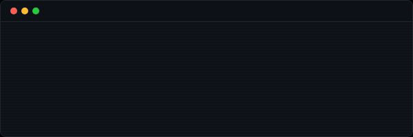

<!-- HEADER BANNER -->

<!-- TYPING SVG -->

---

## `// CURRENT FOCUS` 

<table>
<tr>
<td width="50%" valign="top">

### ⌘ Multi-Agent Orchestration

Frameworks where agents adapt in real-time—stages shift, roles emerge, strategies evolve on the fly.

**Not pipelines. Adaptive task forces.**

&nbsp;

</td>
<td width="50%" valign="top">

### ∞ Autonomous Coding Agents

Desktop harnesses for AI-driven development. Git worktree isolation, self-validating QA loops, Linear sync.

**Agents that build while you sleep.**

&nbsp;

</td>
</tr>
<tr>
<td width="50%" valign="top">

### `{*}` AI-Native Ecosystem

A constellation of tools that feed each other—landing pages in seconds, videos from scripts, marketing that runs itself. Products with gravitational pull.

**An ecosystem with its own gravity.**

&nbsp;

</td>
<td width="50%" valign="top">

### `>|<` Token Compression

Context windows fill up fast. This fixes that. **80% token reduction** on code I/O, **2.5× compression** on session history. Do more with less.

**Same quality. 2× efficiency per token.**

&nbsp;

</td>
</tr>
<tr>
<td width="50%" valign="top">

### `>_` Claude Code Tooling

Session management, real-time statuslines with cost tracking, memory systems for persistent project context.

**Developer tools for AI-native workflows.**

&nbsp;

</td>
<td width="50%" valign="top">

### `)>_` STC Voice Oracle

Speech-to-Code voice interface for your codebase. Ask questions, get answers, build faster. Your code, conversational.

**Your project, embodied.**

&nbsp;

</td>
</tr>
</table>

 

More details when it launches.

  

---

## `// PHILOSOPHY`

> **Tools** are separate from you. You pick them up, use them, put them down.
>
> **Extensions** are *you*—operating in parallel across domains you couldn't reach alone.

 

*The goal isn't automation. It's amplification.*

*The distance between intention and execution should approach zero.*

---

## `// NOW`

<!-- NOW:START -->
🔀 Submitting [per-agent compaction overrides](https://github.com/openclaw/openclaw) PR to OpenClaw upstream — 38 tests, clean 5-commit branch 
🧪 Token compression research — 80% reduction on code I/O 
🎙️ Voice AI interfaces — speech-to-code for codebases 
🌌 Building a constellation of AI agents that coordinate autonomously
<!-- NOW:END -->

---

## `// RECENT ACTIVITY`

### Highlights

<!-- HIGHLIGHTS:START -->
🌿 Created branch `fix/oxfmt-drift` on `curtismercier/openclaw`

🔀 Opened PR [#19329](https://github.com/openclaw/openclaw/pull/19329) on `openclaw/openclaw` — **feat: add per-agent compaction and context pruning overrides** `+922 -329` across 14 files

🌿 Created branch `feat/per-agent-compaction-v2` on `curtismercier/openclaw`

🌿 Created branch `feat/per-agent-compaction` on `curtismercier/openclaw`
<!-- HIGHLIGHTS:END -->

Other activity

<!-- OTHER:START -->
❌ Closed PR [#19659](https://github.com/openclaw/openclaw/pull/19659) on `openclaw/openclaw` — **style: run oxfmt on files with formatting drift** `+4 -4` across 3 files

💬 Commented on [#19659](https://github.com/openclaw/openclaw/pull/19659) in `openclaw/openclaw`

💬 Commented on [#19329](https://github.com/openclaw/openclaw/pull/19329) in `openclaw/openclaw`

⭐ Starred [`inmve/free-ai-coding`](https://github.com/inmve/free-ai-coding)

⭐ Starred [`caddyserver/caddy`](https://github.com/caddyserver/caddy)

⭐ Starred [`Richard-Weiss/lemmy`](https://github.com/Richard-Weiss/lemmy)

⭐ Starred [`gumadeiras/roku-cli`](https://github.com/gumadeiras/roku-cli)

⭐ Starred [`mattingalls/Soundflower`](https://github.com/mattingalls/Soundflower)
<!-- OTHER:END -->

---

## `// TECH STACK`

**AI & ML**

**Frontend**

**Backend**

**Data & Infrastructure**

---

*Stepping out of the shadows.*

